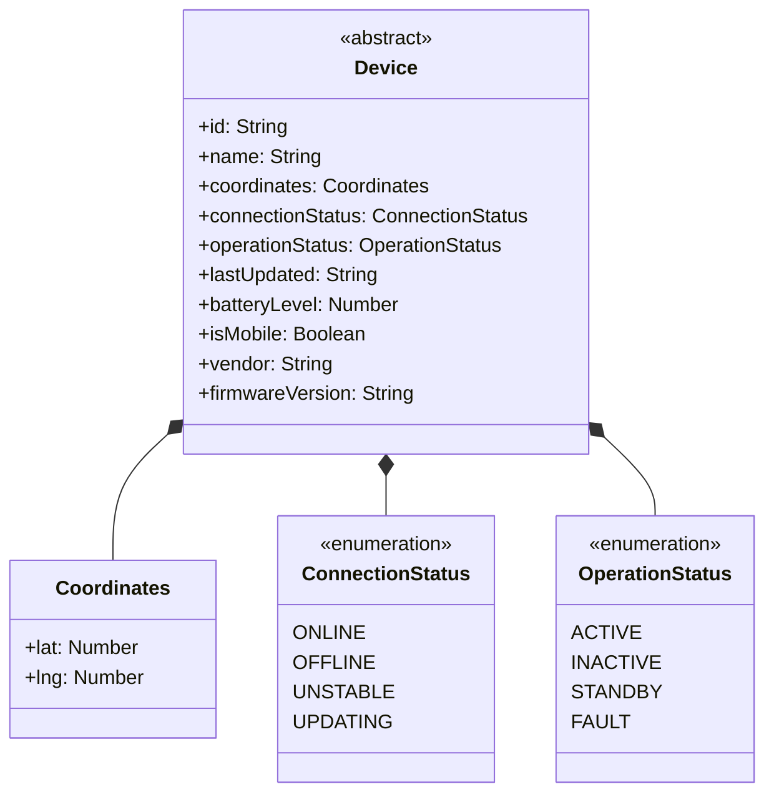
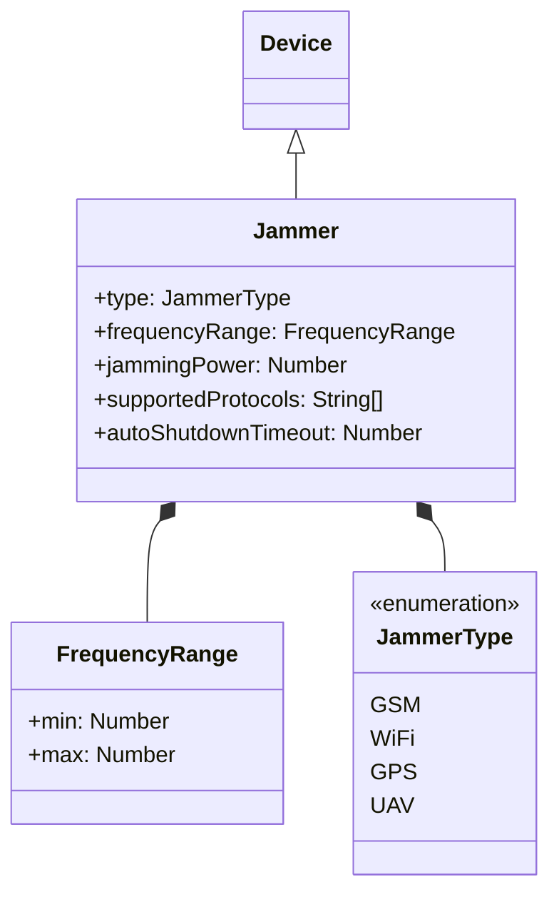
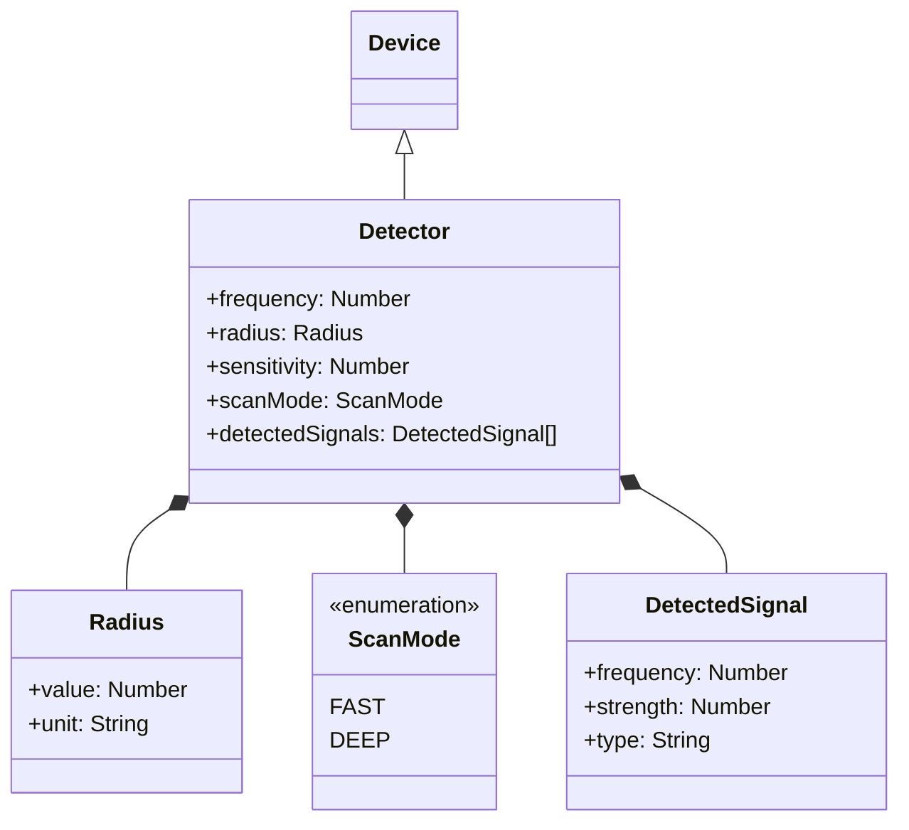
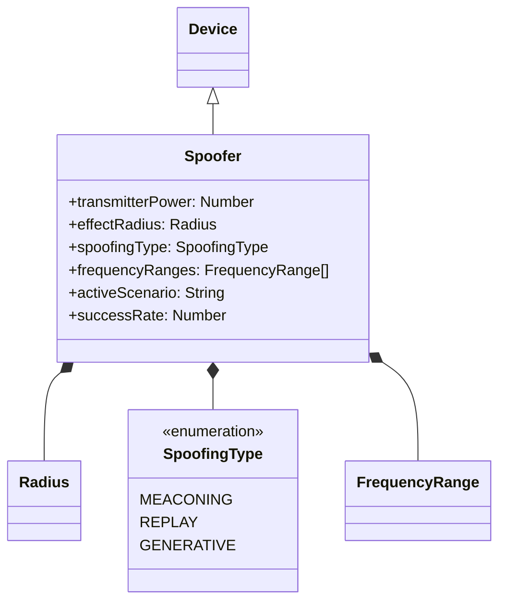
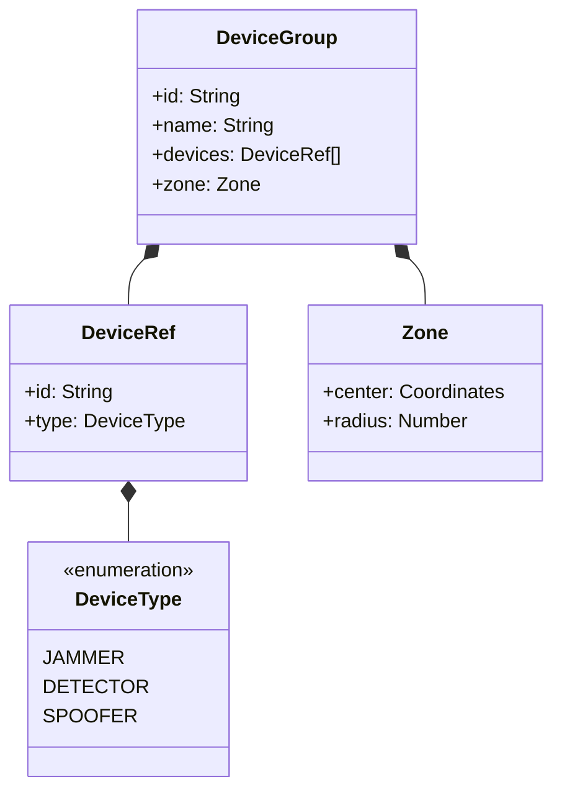
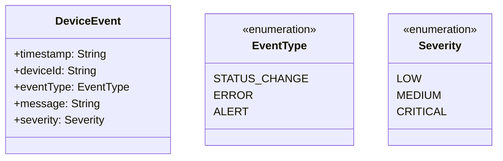
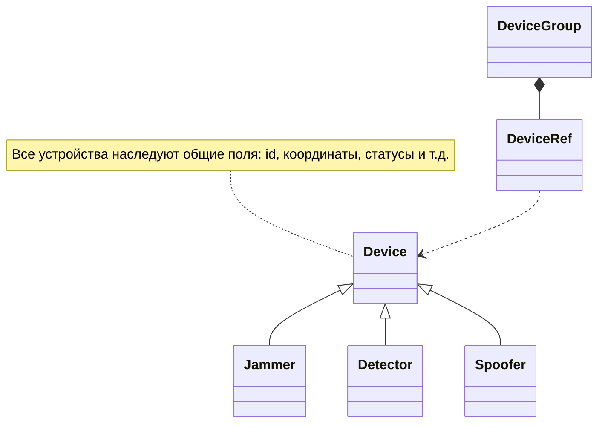

# Диаграммы классов системы управления устройствами

## 1. Базовый класс `Device` и вспомогательные структуры

## 2. Класс `Jammer` (Подавитель)

## 3. Класс `Detector` (Обнаружитель)

## 4. Класс `Spoofer` (Спуфер)

## 5. Вспомогательные сущности
### 5.1. Группа устройств (`DeviceGroup`)

### 5.2. События устройств (`DeviceEvent`)

## Итоговая схема связей

