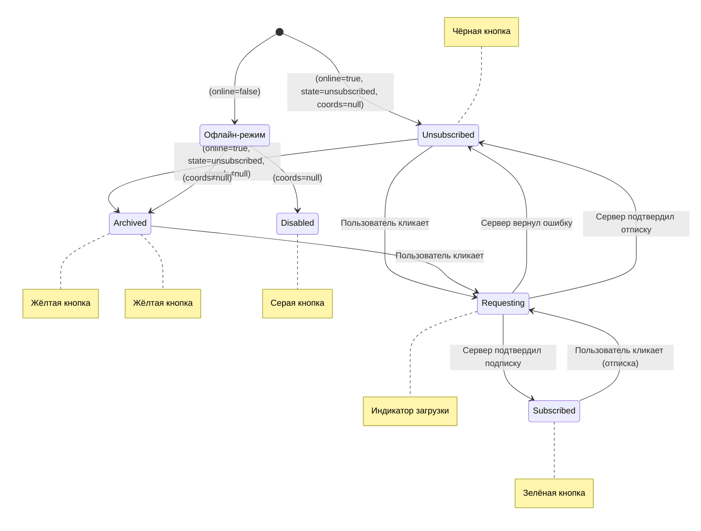

```mermaid
stateDiagram-v2
    [*] --> Unsubscribed: (online=true, state=unsubscribed, coords=null)
    note left of Unsubscribed: Чёрная кнопка
    
    Unsubscribed --> Requesting: Пользователь кликает
    note right of Requesting: Индикатор загрузки
    
    Requesting --> Subscribed: Сервер подтвердил подписку
    note right of Subscribed: Зелёная кнопка
    
    Requesting --> Unsubscribed: Сервер вернул ошибку

    Unsubscribed --> Archived: (online=true, state=unsubscribed, coords≠null)
    note right of Archived: Жёлтая кнопка
    
    Archived --> Requesting: Пользователь кликает

    Subscribed --> Requesting: Пользователь кликает (отписка)
    Requesting --> Unsubscribed: Сервер подтвердил отписку

    state "Офлайн-режим" as offline
    [*] --> offline: (online=false)
    offline --> Disabled: (coords=null)
    note right of Disabled: Серая кнопка
    
    offline --> Archived: (coords≠null)
    note right of Archived: Жёлтая кнопка
```
